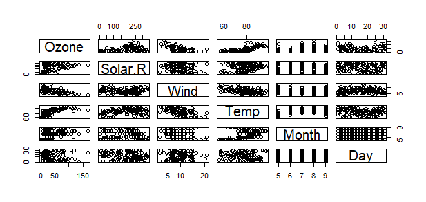

Markdown document test 1
========================

```{r}
library(datasets)
data("airquality")
summary(airquality)
```

###let's first make a histogram of the file.

```{r}
pairs(airquality)
```


###Now we will create a regression model

```{r}
library(stats)
rm <- lm(Ozone ~ Wind + Solar.R + Temp, data = airquality)
summary(rm)
```

We are done


